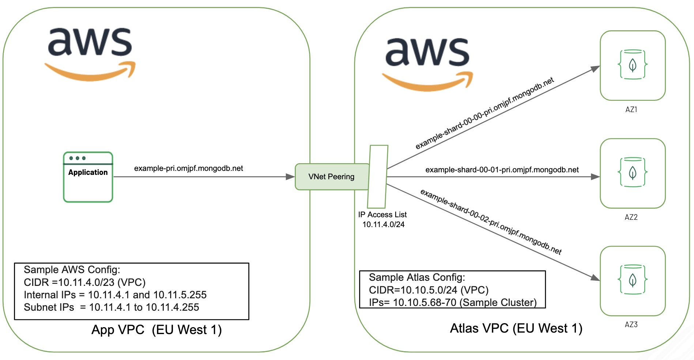

# MongoDB Atlas project Peering Connections in AWS

## Background
Based on an small Proof of Concept to make Atlas available via Peering Connections in AWS in the same region, this script automates all steps. 
The documentation on how to do this manually: https://docs.atlas.mongodb.com/security-private-endpoint 

The end result of the Terraform script is a project in Atlas + a Cluster + provisioned user, Network Peering to AWS with a 1 vm with public interface (ssh/key). The vm has already MongoDB client tools installed.



## Prerequisites:
* Have your AWS cli configured to be used by Terrafrom
* Have Terraform 0.13+ installed
* Run: terraform init 

```
Initializing provider plugins...
- Finding mongodb/mongodbatlas versions matching "~> 1.0.2"...
- Finding hashicorp/aws versions matching "3.6.0"...
- Installing mongodb/mongodbatlas v1.0.2...
- Installed mongodb/mongodbatlas v1.0.2 (signed by a HashiCorp partner, key ID 2A32ED1F3AD25ABF)
- Installing hashicorp/aws v3.6.0...
```

## Config:
* Set up credential, as in section: "Configure Script - Credentials"
* Change basic parameters, as in file : locals.tf
* Run: terraform apply

## Todo:
* Test with terrafrom 14. 

## Basic Terraform resources in script
* mongodbatlas_project, creates an empty project in your Atlas account to provision cidr_block
* mongodbatlas_network_container, create network container
* mongodbatlas_network_peering, request Peering Connection service from Atlas to AWS
* mongodbatlas_project_ip_access_list, add the AWS subnet as accepted IPs
* aws_vpc_peering_connection_accepter, accepte the Peering Connection in AWS automatically

## Provision a Atlas cluster on AWS:
* mongodbatlas_cluster, Create cluster 
* mongodbatlas_database_user, Provision a user to the database

## Bonus: EC2 Ubuntu VM with some basic tools installed: mongo shell, etc
* aws_instance
    
## Configure Script - Credentials: "variables.tf"

To configure the providers, such as Atlas and Azure, one needs credentials to gain access.
In case of MongoDB Atlas a public and private key pair is required. 
How to create an API key pair for an existing Atlas organization can be found here:
https://docs.atlas.mongodb.com/configure-api-access/#programmatic-api-keys
These keys are read from environment variables for safety. Alternatively these parameters
can be provide on the command line of the terraform invocation. The MONGODBATLAS provider will read
the 2 distinct variable, as below:

* MONGODB_ATLAS_PUBLIC_KEY=<PUBLICKEY>
* MONGODB_ATLAS_PRIVATE_KEY=<PRIVATEKEY>

Second a AWS subscription is required.  This is set up via the AWS CLI.
Please check your ~/.aws/config to see if configured

In other for Atlas to initiated the Link, access to AWS the subscription
Id should be know

* TF_VAR_aws_account_id=<AWS_ACCOUNT>

To create a VM with SSH Keys enable, the name of the AWS Key name should be provided
and the path to the private key on your installation host
* TF_VAR_key_name=<AWS_KEYPAIR_NAME>
* TF_VAR_private_key_path=<SSH_PRIVATE_KEY_PATH>

Third there are several other parameters that are trusted, which should be provided via environment variables. See below list of environment variables that are expected.

```
variable "aws_account_id" {
  description = "Aws_account_id ..."
  type = string
}

variable "organization_id" {
  description = "Atlas organization"
  type = string
}

variable "admin_password" {
  description = "Password for default users"
  type = string
}
variable "key_name" {
  description = "Key pair name"
  type = string
}

variable "private_key_path" {
  description = "Access path to private key"
  type = string
}

variable "provisioning_address_cdr" {
  description = "SSH firewall source address, home/office !?"
  type = string
}
```

## Other configuration: "locals.tf"

In the locals resource of the locals.tf file, several parameters should be adapted to your needs
```
locals {
  # Generic project prefix, to rename most components
  prefix                = "EB"    
  # New empty Atlas project name to create in organization
  project_name            = "AWS-Peered-project"
  # Atlas region, https://docs.atlas.mongodb.com/reference/microsoft-azure/#microsoft-azure
  region                = "EU_WEST_1"
  # Atlas cluster name
  cluster_name		      = "${local.prefix}-Cluster"    
  # Atlas Pulic providor
  provider_name         = "AWS"
  # Atlas size name 
  atlas_size_name       = "M10"
  # Atlas cluster Cidr Block no overlapping with AWS
  atlas_cidr_block      = "10.10.5.0/24"

  # AWS Region
  aws_region            = "eu-west-1"
  # AWS CIDR block for new SG/VPC/Subnet/Routing
  # make sure this unique in your AWS account
  aws_route_cidr_block  = "10.11.4.0/23"
  # AWS Subnet block (first 256)
  aws_subnet1_cidr_block = "10.11.4.0/24"
  # AWS Subnet block (second 256)
  aws_subnet2_cidr_block = "10.11.5.0/24"

  # Atlas & Azure vm user_name
  admin_username        = "demouser1"
  # Instance type to use for testing
  aws_ec2_instance      = "t3.medium"
  # Instance name
  aws_ec2_name          = "${local.prefix}-vm"

  # Stuff to install in virtual machine
  python = [
      "sleep 10",
      "sudo apt-get -y update",
	    "sudo apt-get -y install python3-pip",
	    "sudo pip3 install pymongo==3.9.0",
	    "sudo pip3 install dnspython"
  ]
  mongodb = [
      "wget -qO - https://www.mongodb.org/static/pgp/server-5.0.asc | sudo apt-key add -",
      "echo 'deb [ arch=amd64,arm64 ] http://repo.mongodb.com/apt/ubuntu bionic/mongodb-enterprise/5.0 multiverse' | sudo tee /etc/apt/sources.list.d/mongodb-enterprise.list",
      "sudo apt-get update",
      "sudo apt-get install -y mongodb-enterprise mongodb-enterprise-shell mongodb-enterprise-tools"
  ]

  # Generic tag
  tags = { 
    Name = "${local.prefix}-tf-provisioned"
    OwnerContact = "eugene@mongodb.com"
    expire-on = timeadd(timestamp(), "760h")
    purpose = "opportunity"
  }
}
```

## Give it a go

In you favorite shell, run terraform apply and review the execution plan on what will be added, changed and detroyed. Acknowledge by typing: yes 

```
%>  terraform apply
```

Your final result should look like:
```
Apply complete! Resources: 11 added, 0 changed, 0 destroyed.

Outputs:

Virtual_Machine_Address = 34.250.95.182
atlasclusterstring = {
  "aws_private_link" = {}
  "aws_private_link_srv" = {}
  "private" = ""
  "private_endpoint" = []
  "private_srv" = ""
  "standard" = "mongodb://eb-cluster-shard-00-00.eohjr.mongodb.net:27017,eb-cluster-shard-00-01.eohjr.mongodb.net:27017,eb-cluster-shard-00-02.eohjr.mongodb.net:27017/?ssl=true&authSource=admin&replicaSet=atlas-gnov5t-shard-0"
  "standard_srv" = "mongodb+srv://eb-cluster.eohjr.mongodb.net"
}
user1 = demouser1
```

## Now login, if you have your ssh keys properly configured:
```
>$ ssh ubuntu@<IP-ADDRESS>
...
Last login: Mon Feb  8 09:47:34 2021 from **************************

```
Issue the command:   mongo mongodb+srv://eb-cluster.eohjr.mongodb.net --username demouser1 

Your AWS VPC needs to have both DNS hostnames and DNS resolution enabled in order to resolve the above SRV address to private host addresses instead of public IP addresses.  

A work around to resolve to internal IP addresses can be done by adding '-pri' to the service name (or hostnames), e.g.

mongodb+srv://eb-cluster-pri.eohjr.mongodb.net

## Known Bugs or RFEs
* let me know
